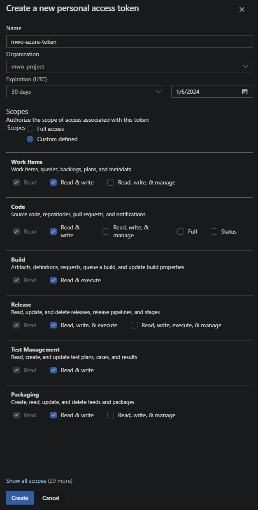

# Mwo 5 - projekt

## Opis aplikacja

Aplikacja, którą wykonałem to prosta aplikacja, w której użytkownik może wpisywać tytuły książek, które chce przeczytać tworząc taką listę `ToDo`. Całość została wykonana w Angularze 16 i Spring Boot 3. Aplikacja posiada również pełną autoryzację za pomocą JWT tokenów i wykonana została według wzorca MVC. ScreenShoty prezentujące przygotowaną aplikację:

<div alignment="center">
    
</div>

<div alignment="center">
    
</div>

<div alignment="center">
    
</div>

<div alignment="center">
    
</div>

<div alignment="center">
    
</div>

## Testy Sellenium

Testy zpstały napisane w języku Java i są uruchamiane poprzez gradle. Poniżej przedstawiam zależności w projekcie, oraz przykładowy test w Sellenium. Uruchamiana aplikacja jest za pomocą driver'a Chrome'a.

<div alignment="center">
    
</div>

<div alignment="center">
    
</div>

## Workflow do uruchamiania testów selenium

Workflow uruchamia się za każdym razem, gdy zostanie wykonany pull request do main'a lub zostanie wykonany push do tego brancha.

```yml
name: Studies project CI/CD integrated with azdo

on:
    push:
        branches: [ "main" ]
    pull_request:
        branches: [ "main" ]

jobs:
    build:
        runs-on: ubuntu-latest

        services:
            note-postgres:
                image: postgres:alpine
                env:
                    POSTGRES_USER: postgres
                    POSTGRES_PASSWORD: none
                    POSTGRES_DB: mwo
                ports:
                    - "5000:5432"
                options: --name mwo

        steps:
            -   name: Run Checkout step
                uses: actions/checkout@v3

            -   name: Set up JDK 17
                uses: actions/setup-java@v3
                with:
                    java-version: '17'
                    distribution: 'temurin'

            -   name: Set up nodejs
                uses: actions/setup-node@v4
                with:
                    node-version: 20

            -   name: Install dependencies
                working-directory: mwo-frontend
                env:
                    SPRING_DATASOURCE_URL: jdbc:postgresql://localhost:5000/mwo
                    BROWSER: chrome
                    POSTGRES_USER: postgres
                    POSTGRES_PASSWORD: none
                    POSTGRES_DB: mwo
                    FRONTEND_URL: http://localhost:4200
                run: npm ci

            -   uses: browser-actions/setup-chrome@latest
            -   run: chrome --version

            -   name: Add executability to file
                run: chmod +x mwo-backend/gradlew

            -   name: Build Angular app and run Selenium tests
                working-directory: mwo-frontend
                env:
                    SPRING_DATASOURCE_URL: jdbc:postgresql://localhost:5000/mwo
                    BROWSER: chrome
                    POSTGRES_USER: postgres
                    POSTGRES_PASSWORD: none
                    POSTGRES_DB: mwo
                    FRONTEND_URL: http://localhost:4200
                run: npm run test-selenium
```

Wynik działania powyższego action:

<div alignment="center">
    
</div>

## Tworzenie ToDo za pomocą github actions na AzureDevOps

Żeby wykonać ten pipeline potrzebne jest wygenerowanie tokenów w Github i AzureDevOps. Do realizacji projektu utworzyłem nowy projekt.

<div alignment="center">
    
</div>

Musiałem także wygenerować tokeny dla Githuba, oraz Azure'a.

Token dla azure'a:

<div alignment="center">
    
</div>

Token dla githuba:

<div alignment="center">
    
</div>

Następnie umieściłem je w zmiennych repozytorium:

<div alignment="center">
    
</div>

Poniżej przedstawiam kod pipeline'u, który uzwględnia integrację z AzureDevOps.

```yml
name: Studies project CI/CD integrated with azdo

on:
    push:
        branches: [ "main" ]
    pull_request:
        branches: [ "main" ]

jobs:
    build:
        runs-on: ubuntu-latest

        services:
            note-postgres:
                image: postgres:alpine
                env:
                    POSTGRES_USER: postgres
                    POSTGRES_PASSWORD: none
                    POSTGRES_DB: mwo
                ports:
                    - "5000:5432"
                options: --name mwo

        steps:
            -   name: Run Checkout step
                uses: actions/checkout@v3

            -   name: Set up JDK 17
                uses: actions/setup-java@v3
                with:
                    java-version: '17'
                    distribution: 'temurin'

            -   name: Set up nodejs
                uses: actions/setup-node@v4
                with:
                    node-version: 20

            -   name: Install dependencies
                working-directory: mwo-frontend
                env:
                    SPRING_DATASOURCE_URL: jdbc:postgresql://localhost:5000/mwo
                    BROWSER: chrome
                    POSTGRES_USER: postgres
                    POSTGRES_PASSWORD: none
                    POSTGRES_DB: mwo
                    FRONTEND_URL: http://localhost:4200
                run: npm ci

            -   uses: browser-actions/setup-chrome@latest
            -   run: chrome --version

            -   name: Add executability to file
                run: chmod +x mwo-backend/gradlew

            -   name: Build Angular app and run Selenium tests
                working-directory: mwo-frontend
                env:
                    SPRING_DATASOURCE_URL: jdbc:postgresql://localhost:5000/mwo
                    BROWSER: chrome
                    POSTGRES_USER: postgres
                    POSTGRES_PASSWORD: none
                    POSTGRES_DB: mwo
                    FRONTEND_URL: http://localhost:4200
                run: npm run test-selenium

            -   uses: stefanstranger/azuredevops-bug-action@1.1
                name: Create Bug in Azure DevOps
                if: failure()
                with:
                    OrganizationName: "mwo-project"
                    PAT: "PAT"
                    ProjectName: "mwo-lab5"
                    AreaPath: "mwo-lab5\\Automation"
                    IterationPath: "mwo-lab5"
                    GithubToken: "GithubToken"
                    WorkflowFileName: "main.yml"
                env:
                    PAT: ${{secrets.PAT}}
                    GithubToken: ${{secrets.API_GITHUB_SECRET}}
```

